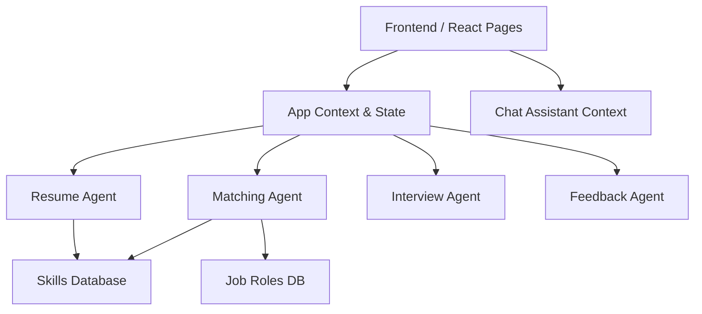

<div align="center">
  
</div>

<h1 align="center">🧠 TalentIQ — AI Recruitment Agent</h1>

<p align="center">
  An autonomous, beautifully crafted AI-powered pipeline engine designed to streamline massive recruitment drives. Built with a specialized 5-agent architecture to handle parsing, matching, interviewing, and analytics.
</p>

<p align="center">
  
  
  
  
</p>

---

## 🚀 Overview

TalentIQ is a complete, enterprise-grade web application built to automate and enhance the recruitment process. The system autonomously filters candidates, parses resumes using NLP heuristics, computes semantic similarities against job descriptions, and generates dynamic interview questions. 

The entire platform is presented through a premium, glassmorphism-styled UI with dark mode aesthetics, dynamic charts, and an embedded AI Chat Assistant.

## 🧩 The Multi-Agent System

This platform relies on a sophisticated Multi-Agent AI Architecture to divide and conquer recruitment tasks:

1. **📄 ResumeAgent**: Extracts skills, parses context, calculates ATS compatibility, and scores resumes.
2. **🎯 MatchingAgent**: Computes semantic similarity between candidate skills and Job Descriptions, detecting skill gaps and overqualification.
3. **💬 InterviewAgent**: Generates tailored technical, behavioral, and coding questions based on the candidate's exact profile and evaluates their answers.
4. **💡 FeedbackAgent**: Explains scoring decisions (Explainable AI), flags biased language in JDs, and recommends upskilling courses.
5. **🤖 ChatAssistant**: A floating, context-aware chatbot that helps recruiters query pipeline metrics and candidate details.

## 🏢 7 Core Modules & Features

### 1. Candidate Analysis Engine
- **Resume Parsing:** Extracts Name, Skills, Experience, and Education from documents.
- **Skill Extraction & Categorization:** Automatically groups skills into Tech, Soft, and Tools.
- **Scoring System:** Calculates Resume Score, ATS Score, and Keyword Density.
- **AI Summary:** Auto-generates a human-readable professional summary.

### 2. Job Matching Engine
- **JD Parsing:** Extracts required skills, domain, and seniority from raw text.
- **Semantic Similarity:** Computes a Match Score (%) based on weighted requirements.
- **Fit Classification:** Automatically badges candidates as High, Medium, or Low fit.
- **Missing Skills Detection:** Flags critical gaps between candidate and role.

### 3. Interview Intelligence
- **Dynamic Question Generator:** Role-specific questions adapting to candidate experience.
- **Difficulty Scaling:** Mixes Easy, Medium, and Hard questions (Behavioral + Technical + Coding).
- **Automated Answer Evaluation:** Scores candidate responses and provides immediate feedback.
- **Performance Summary:** Recommends next steps based on average interview score.

### 4. Recruiter Dashboard
- **Pipeline Overview:** Real-time metrics on candidates, hires, and match averages.
- **Hiring Funnel:** Visual representation of candidate progress.
- **Top Candidates Board:** Auto-sorted list of the highest-matching profiles.

### 5. Candidate Management
- **Advanced Filtering & Sorting:** Filter by domain, fit level, status, or search globally.
- **Bulk Actions:** Shortlist or reject multiple candidates at once.
- **Tagging & Notes:** Add private recruiter notes and custom tags.
- **Export:** Download candidate pipelines to CSV.

### 6. Analytics & Insights
- **Monthly Trend Charts:** Application vs Interview vs Hire trajectories.
- **Score Distributions:** Histogram of candidate match scores.
- **Skill Demand Tracker:** Real-time heat on requested vs available skills.

### 7. System & Admin
- **Role-based Authentication:** Admin and Recruiter views.
- **State Persistence:** Local storage implementation allowing offline capabilities.
- **Pristine UI Design:** Glassmorphic cards, customized scrollbars, and fluid animations.

---

## ⚙️ Tech Stack (Top-Company Level)

| Layer | Technology |
|---|---|
| **Frontend Framework** | React 18 + Vite |
| **Routing** | React Router DOM v6 |
| **Styling** | Tailwind CSS (v3) |
| **Data Visualization** | Recharts |
| **Icons** | Lucide React |
| **Architecture** | Component-Based Multi-Agent System |
| **Deployment** | Ready for Vercel / Netlify / GitHub Pages |

---

## 💻 System Design 



---

## 🚀 How To Run Locally

The application is completely self-contained and runs on a simulated AI backend for immediate testing without API key requirements.

### Prerequisites
- Node.js (v18+)
- npm

### Installation

1. **Clone the repository:**
   ```bash
   git clone https://github.com/swethakapse-19/Ai-Recruitment-agent-.git
   cd Ai-Recruitment-agent-
   ```

2. **Install dependencies:**
   ```bash
   npm install
   ```

3. **Start the development server:**
   ```bash
   npm run dev
   ```

4. **Access the application:**
   Open `http://localhost:5173` in your browser.
   - **Demo Login:** `admin@talentiq.ai`
   - **Demo Password:** `admin123`

---

## 🎨 UI Structure Map

- `/` **Landing Page**: Product intro & Authentication
- `/dashboard`: Live KPIs, Funnel, Top Candidates
- `/upload`: Resume upload + AI pipeline execution
- `/candidates`: Full candidate repository & filters
- `/candidate/:id`: Deep-dive profile, Interview Room, Explainable AI
- `/analytics`: Company-wide metrics & charts

---

*Designed & Developed by Swetha Kapse.*
